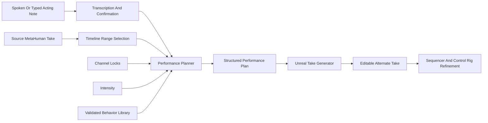

# Prototype Architecture

## Design Principle

The prototype should prove the director workflow first, not solve general animation generation. The safest MVP is a controlled behavior-planning system connected to editable Unreal output.

## System Flow

## Components

### Unreal Editor Plugin

The plugin provides the native editor surface:

- Select source Level Sequence or active take.
- Select revision range.
- Enter typed direction.
- Record spoken direction when voice capture is added.
- Lock channels such as audio, lip sync, facial animation, body animation, and timing.
- Adjust intensity.
- Generate and compare takes.

### Direction Interpreter

The interpreter converts plain directing language into a structured performance plan.

For the first prototype, the interpreter can be rule-based or LLM-assisted, but it must output the same schema either way. This keeps Unreal integration stable as the intelligence improves.

### Behavior Library

The behavior library contains approved recipes for coordinated performance changes. Each recipe defines channel-level instructions, such as:

- Facial tension
- Gaze avoidance
- Gesture reduction
- Defensive posture
- Pre-response pause
- Emotional escalation

The library prevents the prototype from generating uncontrolled or incoherent animation.

### Performance Plan

The plan is the contract between AI interpretation and Unreal execution. It should describe:

- Source take
- Revision range
- Original direction text
- Matched acting interpretations
- Locked channels
- Channel instructions
- Intensity
- Editable output target

### Unreal Take Generator

The generator applies the plan non-destructively by creating a new alternate take. For the prototype, this can be implemented with:

- Additive animation layers
- Control Rig key modifications
- Sequencer sub-sequences
- Animation montage overlays
- Gaze target tracks
- Timing offsets inside the selected range

The exact implementation should be chosen based on the target MetaHuman setup and Unreal version.

## Data Contract

All interpreter output should validate against `schemas/performance_plan.schema.json`. This allows:

- Local planner testing without Unreal.
- LLM integration without changing Unreal code.
- Regression tests for supported acting interpretations.
- Debug-friendly plan inspection.

## MVP Behavior Mapping

| Acting interpretation | Primary channels | Expected visible result |
| --- | --- | --- |
| Open anger | Face, head, posture, gesture | Direct gaze, stronger brows, forward posture, sharper gestures |
| Restrained anger | Face, gaze, posture, timing | Tight jaw, controlled stillness, delayed response, minimal gestures |
| Nervous confidence | Face, gaze, posture, pauses | Brief gaze break, subtle tension, attempted upright posture |
| Defensive | Posture, gesture, head, timing | Closed posture, small retreat, guarded gestures, clipped reaction |
| Concealing information | Gaze, face, timing, posture | Avoidant gaze, micro-pause, masked expression, reduced movement |

## Implementation Notes

- Preserve the source performance by default.
- Treat voice transcription as input capture, not the core intelligence.
- Keep lip sync and dialogue audio locked in the first demo.
- Prefer additive or layered edits so animators can inspect and refine results.
- Log every generated plan for comparison, debugging, and evaluation.
- Keep behavior recipes human-readable so animators can validate them.

